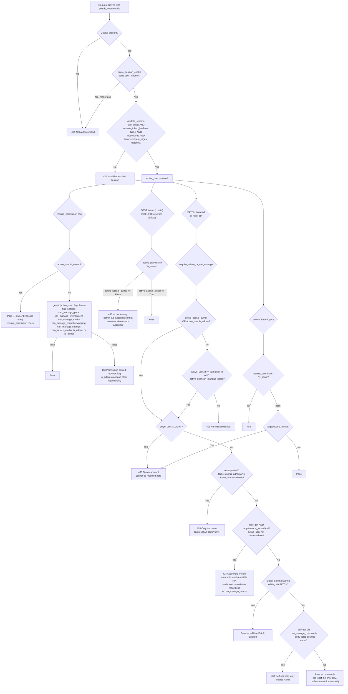

# Peach 1UP — Auth System Reference

Complete map of every auth flow, token/cookie lifecycle, permission model, CORS, and
middleware chain. Read alongside `SECURITY.md` (policy rules) and `TECH.md` (stack).

---

## Directory / File Index

| Path | Purpose |
|------|---------|
| `backend/main.py` | Mounts all routers; sets middleware order (CORS → Security → CSRF → FirstRunGuard → router) |
| `backend/api/middleware/security.py` | `SecurityMiddleware` (localhost enforcement, X-Request-ID), `CSRFMiddleware` (double-submit cookie), `FirstRunGuardMiddleware` (redirect to /first-run), CORS config |
| `backend/api/routes/auth.py` | `/api/v1/auth` — setup-owner, switch, logout, me, refresh |
| `backend/api/routes/users.py` | `/api/v1/users` — CRUD users, reset-pin, unlock. `GET /api/v1/users` (list) is intentionally unauthenticated — see dedicated section below |
| `backend/api/routes/settings.py` | `/api/v1/settings` — first-run-status, complete-first-run, patch settings |
| `backend/core/dependencies.py` | `get_active_user`, `require_permission`, `require_self_or_admin`, `require_admin_or_self_manage`, `get_filtered_collections` / `get_filtered_collection` |
| `backend/core/identity.py` | `generate_identity_secret`, `mint_session_token`, `issue_session`, `extend_session`, `clear_session`, `validate_session`, `parse_session_cookie` — HMAC-derived session tokens, no separate token table |
| `backend/models/user.py` | `User` DB model + `UserRead` response schema; carries `identity_token_secret`, `session_token_hash`, `session_token_expires_at`, `session_token_ttl` |
| `backend/models/media_restriction.py` | `MediaRestriction` — per-user item block list |
| `backend/core/lifespan.py` | Startup: DB init, first-run flag sync, owner-exists check |
| `scripts/setup_admin_user.py` | CLI emergency owner reset (bypasses web, writes DB directly) |
| `frontend/src/api/client.ts` | `ApiClient` — all requests, `credentials: "include"`, `X-CSRF-Token` header on mutating requests, session-expired event dispatch |
| `frontend/src/context/AppContext.tsx` | Mounts provider; calls `GET /auth/me` on load then `POST /auth/refresh` to extend the session; `useRef` guard prevents the mount effect's `/auth/me` → `/auth/refresh` chain from double-firing under StrictMode; listens for `session-expired` event |
| `frontend/src/context/_AppContext.ts` | `AppState`, `AppAction`, `appReducer` — `activeUser`, `showUnauthModal` |
| `frontend/src/pages/FirstRun/index.tsx` | Wizard shell; polls first-run-status; calls complete-first-run |
| `frontend/src/pages/FirstRun/Step0Owner.tsx` | Form that calls `POST /auth/setup-owner` and sets `activeUser` |
| `frontend/src/components/UserSwitcher.tsx` | User-switch UI; PIN modal; calls `POST /auth/switch` |
| `frontend/src/components/layout/AppShell.tsx` | Shows signed-out banner on `showUnauthModal`; navigates to `/users` (the standalone switch-account page) when unauthenticated |
| `frontend/src/pages/Users/index.tsx` | Standalone Users/switch-account page (moved out of Settings) — lists accounts via unauthenticated `GET /api/v1/users`, owner-only create/delete controls, admin-only edit/reset-pin/unlock controls |

---

## Token & Cookie Model

| Property | Value |
|----------|-------|
| Session cookie name | `peach_token` |
| Session cookie flags | `HttpOnly`, `SameSite=Lax`, `Secure` follows `ALLOW_NETWORK_ACCESS` — `False` while it's off (default, localhost only), `True` once it's set to `true`. With `Secure=True` and no TLS-terminating reverse proxy in front of the service, browsers silently drop the cookie over plain HTTP — login appears to succeed but every subsequent request looks unauthenticated, producing an infinite re-login loop with no error shown (see SECURITY.md § Network Rules) |
| CSRF cookie name | `peach_csrf` |
| CSRF cookie flags | **Not** HttpOnly (JS-readable), `SameSite=Lax`, `Secure` follows `ALLOW_NETWORK_ACCESS` the same way as the session cookie; same `max_age` as session token |
| CSRF enforcement | `CSRFMiddleware` — all state-mutating requests must send `X-CSRF-Token` header matching `peach_csrf` value; auth endpoints (`/api/v1/auth/*`) exempt |
| Token storage | Columns on the `User` row — `identity_token_secret`, `session_token_hash`, `session_token_expires_at`, `session_token_ttl`. No separate table |
| Token value | `mint_session_token(identity_token_secret)` → HMAC-SHA256(`identity_token_secret`, `nonce + issued_at`), hex digest. Cookie stores `{user_id}.{session_token}`; only `hash_session_token()` (plain SHA-256) of it is persisted |
| Default expiry | No expiry (`session_token_expires_at = NULL`) unless `User.session_token_ttl` (minutes) is set |
| Multiple sessions | Not allowed — one active session per user by design. `issue_session()` overwrites `session_token_hash` directly, so a new login naturally invalidates any prior session. Used only by `/auth/setup-owner`, `/auth/switch` — never by `/auth/refresh` |
| Session extension | `extend_session(db, user)` — recomputes `session_token_expires_at` from `session_token_ttl` only; never touches `session_token_hash`, never mints a new token. Used by `/auth/refresh` so validate-and-extend is idempotent across concurrent calls (StrictMode double-mount, multiple tabs, retries) — the old rotate-on-refresh design 401'd the second of two near-simultaneous refresh calls because the first overwrote the hash the second was still presenting |
| Revocation | `clear_session()` nulls `session_token_hash` and `session_token_expires_at` on the user row — used by `/auth/logout`; no row to delete |
| Session validation | `validate_session(db, user_id, token)` — None if user missing, None if `session_token_hash` is `NULL` (logged out), None if `session_token_expires_at` has passed, then `hmac.compare_digest` of the hash against the presented token |
| Expired/revoked cleanup | None needed — no accumulated rows. Expiry and revocation are point-in-time checks against the single hash column, not a cleanup job |
| Frontend sends cookie | Every request via `credentials: "include"` in `ApiClient.fetch` |
| Frontend sends CSRF | `ApiClient.fetch` reads `peach_csrf` from `document.cookie` and adds `X-CSRF-Token` header on all non-GET/HEAD/OPTIONS requests |

---

## Permission Flags

| Flag | Default for owner | Default for sub-account | What it gates |
|------|:-:|:-:|------|
| `is_owner` | `True` | always `False` | Bypasses all `require_permission` checks; owner-only operations, including create/delete sub-account (`is_owner` is also used directly as the gating flag on those two endpoints — see Flow 9, Flow 13) |
| `is_admin` | `True` | `False` | Gates endpoints that check `is_admin` directly: edit/reset-pin/unlock/force-logout sub-account, plus various admin-only settings/emulator/BIOS endpoints. Does **not** implicitly grant any other `can_*` flag — `require_permission()` only special-cases `is_owner` for bypass; every other flag (including `is_admin` itself) is checked independently via `getattr(active_user, flag, False)`. On `reset-pin` specifically, an admin may target only regular/capped sub-accounts — the owner and every admin (including the caller's own record) are rejected with 403; only the owner may reset an owner-adjacent PIN |
| `can_launch_media` | `True` | `True` | Launch any permitted software collection |
| `can_manage_game` | `True` | `False` | Add/edit/delete software collections and items and their drives, run `POST /software/scan` and import-from-path, **and** create/modify/delete launch Profiles (`routes/profiles.py`). Was `can_edit_library` → `can_edit_software` → this name |
| `can_manage_environment` | `True` | `False` | Register/modify Environments (Windows OS install workspaces). Was `can_edit_platforms` |
| `can_manage_media` | `True` | `False` | Add/edit/delete Media (the archival audio/text/image/video domain) |
| `can_manage_controllerMapping` | `True` | `False` | Create/edit/delete controller mappings (System → Controllers) |
| `can_manage_settings` | `True` | `False` | Modify application settings |
| `can_manage_users` | `True` (irrelevant — owner bypasses) | `False` | Lets a sub-account edit **its own** `name` via `PATCH /users/{id}` and reset **its own** PIN via `POST /users/{id}/reset-pin` — nothing else. Grants no capability over any other user's account, no delete, and none of the owner-only create/delete-sub-account operations. Owner-only to grant, like every permission flag. Gated by `require_admin_or_self_manage` in `dependencies.py`, which is checked in addition to (not instead of) the existing `is_admin`-targets-others path on those two endpoints |

`require_permission(flag)` in `dependencies.py`: owner bypasses unconditionally; others must have the literal boolean flag set (`is_admin` included — it grants no other flag implicitly). Returns 403 on failure.

### ACL Decision Tree



---

## Middleware Chain (LIFO — last-added runs first)

```
Browser request
  → CORSMiddleware          — preflight handling; allow_origins defaults to ["http://localhost:5173"] + optional CORS_ORIGIN env
  → SecurityMiddleware      — reject non-localhost clients when ALLOW_NETWORK_ACCESS=false; inject X-Request-ID
  → CSRFMiddleware          — double-submit cookie check for all state-mutating requests; exempt: safe methods, /api/v1/auth/* endpoints, requests with no session cookie
  → FirstRunGuardMiddleware — redirect non-API, non-asset, non /first-run paths to /first-run when first_run_complete is false
  → Router / Handler
```

CORS origins: `http://localhost:5173` always included; `CORS_ORIGIN` env var adds one override. `allow_credentials=True`, `allow_methods=["*"]`, `allow_headers=["*"]`.

`FirstRunGuardMiddleware` reads `_first_run_done_cache` (in-memory bool set at startup from DB and again when `complete-first-run` is called). No DB query per request.

`CSRFMiddleware`: if no `peach_token` cookie is present the check is skipped entirely, so unauthenticated callers get a 401 from the auth dependency rather than a misleading 403.

OPTIONS requests bypass both `SecurityMiddleware` and `FirstRunGuardMiddleware`.

---

## Flow 1 — First Launch (no owner, no DB)

```
App starts
  → lifespan: init DB, create tables, run migrations
  → _sync_first_run_from_db → first_run_complete = false → _first_run_done_cache = false
  → _ensure_owner_user → no owner → logs warning "Complete the first-run setup"
  → FirstRunGuardMiddleware active

Browser opens http://localhost:8000/
  → SecurityMiddleware: client=localhost → pass
  → FirstRunGuardMiddleware: first_run_complete=false, path="/" → redirect /first-run

Browser loads /first-run
  → GET /api/v1/settings/first-run-status (unauthenticated, API path bypasses guard)
    → returns { first_run_complete: false, owner_exists: false }
  → FirstRun page renders Step0Owner form

User fills name + PIN + confirm PIN → clicks "Create Account"
  → POST /api/v1/auth/setup-owner
    → check: no existing owner → pass
    → validate: name non-empty, PIN 4-6 digits, PINs match
    → Argon2id hash PIN → create User(is_owner=true, is_admin=true, all permissions=true,
      identity_token_secret=generate_identity_secret())
    → issue_session(db, owner) → mint HMAC session token, store its hash on the user row
    → Set-Cookie: peach_token=<user_id>.<token>; HttpOnly; SameSite=Lax
    → Set-Cookie: peach_csrf=<random>; SameSite=Lax (JS-readable)
    → return { user: UserRead }
  → Frontend: dispatch SET_ACTIVE_USER
  → Frontend: call POST /api/v1/settings/complete-first-run
    → require_permission("can_manage_settings") → owner → pass
    → write settings row first_run_complete="true"
    → set_first_run_complete() → _first_run_done_cache = true
  → Frontend: window.location.replace("/") → full reload → redirect to /software
```

---

## Flow 2 — Normal App Boot (owner exists, session may exist)

```
App starts
  → lifespan: DB ready, first_run_complete=true → _first_run_done_cache=true
  → FirstRunGuardMiddleware inactive (passthrough)

Browser opens app
  → AppProvider mounts → calls GET /api/v1/auth/me
    → cookie peach_token present?
      → YES → parse_session_cookie splits it into (user_id, token); validate_session
               checks session_token_hash matches and not expired → return User
               → dispatch SET_ACTIVE_USER (also clears showUnauthModal)
               → then calls POST /api/v1/auth/refresh (non-fatal)
                 → extend_session pushes out session_token_expires_at only — same
                   token, same session_token_hash, no rotation
                 → peach_token cookie re-set with the same token value and a refreshed
                   max_age only if session_token_ttl is set; peach_csrf cookie re-set
                 → dispatch SET_ACTIVE_USER with refreshed user
      → NO  → 401 → dispatch LOGOUT → showUnauthModal=true

A useRef guard in AppProvider's mount effect ensures this /auth/me → /auth/refresh chain
only fires once per mount, even under React StrictMode's double-invoke in dev.
```

---

## Flow 3 — Session Expiry / Token Invalid Mid-Session

```
Any API call with a cookie that fails validation (no hash set, expired, or token mismatch)
  → Backend: validate_session returns None → 401 Unauthorized

ApiClient.fetch receives 401
  → isSessionError = true
  → dispatch CustomEvent("session-expired")

AppProvider listener fires
  → dispatch LOGOUT → activeUser=null, showUnauthModal=true

AppShell detects showUnauthModal=true
  → navigate("/users")
  → renders signed-out banner "You have been signed out. Please sign in to continue."

User clicks another account in UserSwitcher → PIN modal → POST /auth/switch → new token issued
```

---

## Flow 4 — User Switch (owner account)

```
UserSwitcher: user clicks owner card (always requires PIN even if already active)
  → setPinTarget(owner)

PinModal renders → user enters PIN → form submit
  → POST /api/v1/auth/switch { user_id: <owner_id>, pin: "<pin>" }
    → fetch user by id
    → user.is_locked? → 403
    → user.is_owner=true → require non-empty PIN
    → _verify_pin(pin, pin_hash) via argon2.PasswordHasher.verify()
      → FAIL → failed_pin_attempts++ → if >=4: is_locked=true → 401
      → PASS → failed_pin_attempts=0 → issue_session → Set-Cookie (peach_token, peach_csrf) → return user
  → dispatch SET_ACTIVE_USER(owner)
  → queryClient.invalidateQueries(["library"]) — re-fetches filtered library for new user
```

---

## Flow 5 — User Switch (sub-account, PIN required)

```
UserSwitcher: user.pin_required=true OR user.is_locked → setPinTarget(user)

PinModal: user enters PIN → POST /api/v1/auth/switch { user_id, pin }
  → user.is_owner=false
  → user.pin_required=true
  → _verify_pin → FAIL → attempts++ → lock at 4 → 401
  → _verify_pin → PASS → attempts=0 → issue_session → Set-Cookie (peach_token, peach_csrf) → return user
```

---

## Flow 6 — User Switch (sub-account, no PIN)

```
UserSwitcher: user.pin_required=false AND user.id != activeId AND !user.is_locked
  → direct call POST /api/v1/auth/switch { user_id, pin: "" }
    → user.is_owner=false, pin_required=false
    → skip PIN check → failed_pin_attempts=0 → issue_session → Set-Cookie (peach_token, peach_csrf) → return user
  → dispatch SET_ACTIVE_USER
```

---

## Flow 7 — Session Refresh (on every app open)

```
AppProvider: after successful GET /auth/me, calls POST /api/v1/auth/refresh
  → reads peach_token from cookie, parse_session_cookie → (user_id, token)
  → validate_session resolves current user (401 if missing/expired/mismatched)
  → extend_session(db, user) → recomputes session_token_expires_at from
    session_token_ttl only; session_token_hash (and therefore the token itself)
    is never touched — refresh validates-and-extends, it does not rotate
  → _set_auth_cookie re-sent with the *same* already-parsed token and a refreshed
    max_age, but only if session_token_ttl is set (skipped entirely for
    non-expiring sessions — nothing to extend)
  → _set_csrf_cookie → new peach_csrf cookie overwrites old
  → return { user: UserRead }
  → dispatch SET_ACTIVE_USER(refreshed user)

Failure is non-fatal — catch() swallows the error; the original session from /auth/me remains
valid until its own expiry.

Why not rotate: the prior design called issue_session() here, minting a new token and
overwriting session_token_hash on every refresh. Two legitimate near-simultaneous refresh
calls from the same session (React StrictMode double-mount, multiple browser tabs, network
retries) would race — the first call's commit invalidates the token the second call is still
presenting, producing a spurious 401 and an auto-sign-out. Token issuance remains exclusive
to /auth/setup-owner, /auth/switch — refresh only ever extends. Per DECISIONS.md 2026-06-20,
this dissolves (rather than violates) the documented "two-row rollback-safety" tradeoff: since
refresh never creates a second token, there is nothing to roll back to begin with.
```

---

## Flow 8 — Logout

```
Any logout action (no explicit logout button exists in UI currently — flow via session expiry or manual)
  → POST /api/v1/auth/logout
    → read peach_token from cookie
    → parse_session_cookie → (user_id, token); validate_session(db, user_id, token)
      → only if the token actually validates: clear_session(db, user) nulls
        session_token_hash and session_token_expires_at
      → a present-but-invalid cookie is a no-op — prevents a guessed/garbage token paired
        with someone else's user_id from force-clearing their session with no proof of
        possession of their real token
    → response.delete_cookie("peach_token", samesite="lax")
    → response.delete_cookie("peach_csrf", httponly=False, samesite="lax")
    → return { success: true }
  → dispatch LOGOUT → activeUser=null, showUnauthModal=true
```

---

## Flow 9 — Create Sub-Account (owner only)

```
Users page: owner clicks "+ Add Account" → modal opens (button hidden from admin
  sub-accounts — frontend gates on is_owner, not is_admin)
  → fill name, optional PIN, permissions checkboxes, content rating, session expiry

Owner submits → POST /api/v1/users
  → require_permission("is_owner") → owner bypasses; this is owner-only, an
    is_admin=true sub-account gets 403 here even though it can edit/reset-pin/
    unlock/force-logout existing sub-accounts
  → validate PIN (4-6 digits regex) if provided
  → Argon2id hash PIN (argon2.low_level.hash_secret, urandom(16) salt)
  → insert User row (is_owner=false always)
  → return UserRead (pin_hash never returned)
```

---

## Flow 10 — Edit Sub-Account Permissions (admin-edits-other, OR self-edit via can_manage_users)

```
Users page: admin edits permissions (currently no inline edit UI — PATCH is backend-only)
  → PATCH /api/v1/users/{user_id}
    → require_admin_or_self_manage:
        active_user.is_owner OR active_user.is_admin → pass (existing path, unchanged)
        else: active_user.id == user_id AND active_user.can_manage_users → pass (new path)
        else → 403
    → target user.is_owner=true → 403 (owner cannot be modified here, regardless of which path passed)
    → if caller is owner/admin: apply all fields from UserPatch (name, permissions,
      content rating, pin_required, session_token_ttl) — unchanged
    → if caller is self-editing via can_manage_users only (not owner/admin): any
      UserPatch field other than name is rejected with 403 — self-edit cannot touch
      its own permission flags, rating, pin_required, or session_token_ttl
    → db.commit → return updated UserRead
```

---

## Flow 11 — Reset PIN (admin resets another user's PIN, OR self-reset via can_manage_users)

```
Users page: admin clicks key icon on a user → Reset PIN modal
  → enter new PIN → POST /api/v1/users/{user_id}/reset-pin { pin }
    → require_admin_or_self_manage:
        active_user.is_owner OR active_user.is_admin → pass (existing path, unchanged)
        else: active_user.id == user_id AND active_user.can_manage_users → pass (new path —
          a sub-account resetting its own PIN; body only ever contains `pin`, so no
          field-restriction logic is needed here the way it is on PATCH)
        else → 403
    → target user.is_owner → 403 Owner account cannot be modified here
    → target user.is_admin AND active_user is NOT owner → 403 Only the owner can reset
        an admin's PIN (blocks admin-resets-admin and admin-resets-self, regardless of
        lock state)
    → target user.is_locked AND active_user is NOT owner/admin → 403 Account is locked;
        an admin must reset this PIN (self-reset is unavailable the moment is_locked is
        true, regardless of can_manage_users — falls through to the admin/owner path only,
        checked in the route handler in addition to require_admin_or_self_manage)
    → _validate_pin(pin) — 4-6 digit regex
    → _hash_pin → new Argon2id hash with fresh urandom(16) salt
    → user.pin_hash = new_hash, pin_required=true, failed_pin_attempts=0, is_locked=false
    → return UserRead
```

---

## Flow 12 — Unlock Locked Account (admin)

```
Users page: admin clicks unlock icon on a locked user
  → POST /api/v1/users/{user_id}/unlock
    → require_permission("is_admin")
    → user.is_locked=false, failed_pin_attempts=0
    → return UserRead
```

---

## Flow 13 — Delete Sub-Account (owner only)

```
Users page: owner clicks trash icon → browser confirm() dialog (button hidden
  from admin sub-accounts — frontend gates on is_owner, not is_admin)
  → DELETE /api/v1/users/{user_id}
    → require_permission("is_owner") → owner-only; no self-delete side door —
      an admin sub-account can no longer delete itself or any other sub-account
      (this replaced require_self_or_admin, which previously allowed both)
    → target user.is_owner → 403 — since only the owner can call this endpoint
      at all, the only way the target is the owner is the owner targeting their
      own account; this guard is what actually blocks owner self-deletion
    → delete MediaRestriction rows for user_id
    → reassign Profile.user_id → owner.id (profiles are not deleted)
    → db.delete(user) → commit
```

---

## Flow 14 — Owner Lockout Recovery (CLI)

```
Owner locked out (4+ failed PINs) or PIN forgotten
  → Run: python scripts/setup_admin_user.py
    → reads DB path via backend.core.settings.get_db_path() (fixed at database/data/peach1up.db, not configurable)
    → prompt: Owner name, PIN, confirm PIN
    → if owner exists: overwrite name, pin_hash, reset failed_pin_attempts=0, is_locked=false
    → if no owner: create User(id=1, is_owner=true, all permissions=true)
    → commit
    → no web session issued — user must switch to owner account in UI next launch
```

---

## Flow 15 — Permission Check on Any Protected API Endpoint

```
Request arrives with peach_token cookie
  → get_active_user(request, db):
    → cookie missing → 401
    → parse_session_cookie fails (no separator / non-numeric user_id) → 401
    → validate_session: user missing, session_token_hash is NULL (logged out), token expired,
      or presented token doesn't match the stored hash → 401
    → return User

require_permission("some_flag")(active_user):
  → active_user.is_owner → pass (owner bypasses all flags)
  → getattr(active_user, "some_flag", False) → False → 403
  → True → pass

require_self_or_admin:
  → active_user.id == path user_id → pass
  → active_user.is_admin → pass
  → else → 403
```

---

## Flow 16 — Content Rating / Media Restriction (software collection filtering)

```
GET /api/v1/software (or any endpoint using get_filtered_collections)
  → get_active_user → user
  → get_filtered_collections(user, db):
    → user.is_owner → return all collections (no filter)
    → exclude collections in MediaRestriction WHERE user_item_id=user.id (game_item_bundle_id — also
      spans media_item_bundle_id and app_item_bundle_id for the Media/App domains)
    → block_unrated_media=true → exclude collections WHERE content_rating IS NULL OR ""
    → max_content_rating set → load rating_ordinals from settings (or defaults; ⚠ no write path exists today, see SECURITY.md Known Gaps)
      → compute allowed set: all ratings with ordinal ≤ max
      → filter FAILS CLOSED: a collection passes only if its rating is NULL/empty or in
        the allowed set. An unrecognised rating is DENIED, not passed through; and if the
        user's own ceiling can't resolve to a known ordinal, no rated content passes
```

MediaRestriction rows are managed by admin via `GET/PUT /api/v1/softwarecollection/{collection_id}/restrictions` (requires `is_admin`).

---

## Flow 17 — Destructive Operation Confirmation Token

```
Example: delete software collection

Step 1 — POST /api/v1/softwarecollection/{collection_id}/confirm-delete
  → require_permission("can_manage_game")
  → confirmation_tokens.issue("software", collection_id) → in-memory store, 60s TTL
  → return { confirmation_token, expires_in_seconds: 60 }

Step 2 — DELETE /api/v1/softwarecollection/{collection_id}?confirmation_token=<token>
  → require_permission("can_manage_game")
  → confirmation_tokens.consume(token, "software", collection_id) → validates type+id+expiry
  → FAIL → 400 "Invalid or expired confirmation token"
  → PASS → delete collection

Same pattern applies to: environment delete, drive delete, snapshot delete/restore.
Admin sandbox reset uses install_registry's own confirm token (same TTL model).
```

---

## Flow 18 — First-Run Already Completed (owner_exists but flag not set)

```
Edge case: DB has owner but first_run_complete flag missing (e.g. DB restored)

Browser opens /first-run
  → GET /api/v1/settings/first-run-status
    → first_run_complete=false, owner_exists=true
  → FirstRun renders "Setup Complete" screen (not the owner-creation form)
  → User clicks "Continue" → POST /api/v1/settings/complete-first-run
    → require_permission("can_manage_settings") → must be authenticated as owner
    → writes first_run_complete="true", sets in-memory cache
```

---

## GET /api/v1/users — Intentionally Unauthenticated

```
GET /api/v1/users has no auth dependency — list_users(db) takes no active-user check.
Only UserRead is returned (no pin_hash, no session_token_hash, no identity_token_secret),
so this never exposes anything that proves identity or grants access.

Why: this is the data source for the switch-account screen (frontend/src/pages/Users) that
a signed-out user lands on. POST /api/v1/auth/switch already requires no prior session — you
present a user_id + PIN, not a cookie — so gating the *list* of users behind auth created a
lockout: a session-expired user was redirected to /users to log back in, but the page's own
GET /api/v1/users call 401'd, leaving no way to see which account to switch to.

All mutating endpoints on this router remain authenticated/gated as before:
GET /api/v1/users/{id} requires Depends(get_active_user); POST (create) and DELETE
require require_permission("is_owner") (owner-only, see Flow 9 / Flow 13); PATCH
and /reset-pin require require_admin_or_self_manage (admin/owner targeting anyone,
OR a sub-account with can_manage_users targeting itself only — see Flow 10 / Flow 11);
/unlock and /force-logout require require_permission("is_admin") (unchanged). All
five carry an owner-target guard regardless of which path let the caller in.
```

---

## Secrets Never Exposed

- `pin_hash` — excluded from `UserRead`; never returned by any endpoint
- `token` value — set as cookie only; never in response body, never logged
- `Authorization` headers — stripped by middleware before any log output
- IGDB / third-party API keys — `.env` only; never returned by API
- Recovery key — shown once at first run (see SECURITY.md); stored as Argon2id hash only

---

## Known Gaps (auth-specific) — All Fixed

All gaps identified at audit time have been resolved.

| Gap | Fix |
|-----|-----|
| `GET /api/v1/users` had no auth guard | Added `Depends(get_active_user)` — `users.py`. **Superseded 2026-06-21** (see below): this re-introduced a different bug once Users moved to its own route, so the guard was removed again — `GET /api/v1/users` is now intentionally unauthenticated. |
| Duplicate `GET /auth/me` in `AppShell` | Removed redundant call; `AppProvider` is the single source — `AppShell.tsx` |
| `complete-first-run` implicit trust | Not a real gap — owner session from `setup-owner` satisfies `can_manage_settings`. Documented here for clarity. |
| No CSRF protection | `CSRFMiddleware` added (double-submit cookie pattern). `peach_csrf` non-HttpOnly cookie set on every token issue; `X-CSRF-Token` header required on all mutating non-auth requests. Auth endpoints (`/api/v1/auth/*`) exempt. — `security.py`, `main.py`, `auth.py`, `client.ts` |
| `session-expired` fired on 403 (locked-account switch logged out active user) | `isSessionError` simplified to `res.status === 401` only — `client.ts` |
| No session refresh / expiry warning | `POST /api/v1/auth/refresh` endpoint added; called on every app open in `AppContext`. — `auth.py`, `AppContext.tsx` |
| Refresh rotated the session token (`issue_session`), 401-ing a second concurrent refresh call presenting the now-stale token (StrictMode double-mount, multi-tab, retries) | `refresh_session` now calls `extend_session` (validate-and-extend, never rotates) instead of `issue_session` — `identity.py`, `auth.py`. Frontend `AppProvider` mount effect also gained a `useRef` guard as defense-in-depth — `AppContext.tsx` |
| `AppShell`'s `showUnauthModal` effect redirected to `/settings`, a stale target from before Users moved to its own `/users` route — anyone signed out while on `/users` got bounced to a page that can no longer help them sign back in | Redirect target changed to `/users` — `AppShell.tsx` |
| `GET /api/v1/users` required auth, but it's the data source for the very switch-account screen a signed-out user is redirected to — circular lockout, no way to see which account to switch to | Removed the auth dependency from `list_users`; `UserRead` excludes all secrets so this exposes nothing sensitive. Mutating endpoints on the same router are unaffected — `users.py` |

*Note: the fixes above were implemented against the original `auth_tokens` table / `token_store.py` model. That model was superseded on 2026-06-20 by the identity/session model in `backend/core/identity.py` (see DECISIONS.md) — `token_store.py` and the `auth_tokens` table no longer exist. The gaps and their fixes remain valid; only the underlying token-storage mechanism changed.*
