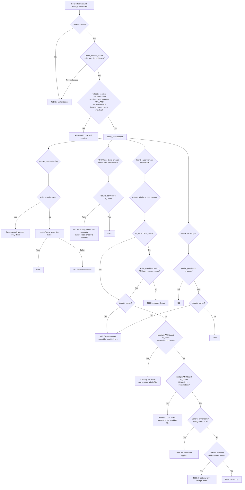

# Auth Reference

Every auth flow, the token and cookie lifecycle, the permission model, CORS, and the
middleware chain.

Read alongside [SECURITY.md](SECURITY.md) (policy rules) and [TECH.md](TECH.md) (stack).

## File index

| Path | Purpose |
|---|---|
| [`backend/main.py`](../backend/main.py) | Mounts routers, sets middleware order, registers the `/media` route, the `/docs` static mount, and the SPA catch-all |
| [`api/middleware/security.py`](../backend/api/middleware/security.py) | `SecurityMiddleware` (localhost enforcement, `X-Request-ID`), `CSRFMiddleware` (double-submit cookie), `FirstRunGuardMiddleware`, `configure_cors` |
| [`api/middleware/request_logging.py`](../backend/api/middleware/request_logging.py) | Logs method, path, status, and duration only. No headers, no bodies |
| [`api/routes/auth.py`](../backend/api/routes/auth.py) | `/api/v1/auth`: setup-owner, switch, logout, me, refresh |
| [`api/routes/users.py`](../backend/api/routes/users.py) | `/api/v1/user-items`: CRUD, reset-pin, unlock, force-logout |
| [`api/routes/settings.py`](../backend/api/routes/settings.py) | `/api/v1/settings`: first-run status, complete-first-run, patch, pin-pepper |
| [`core/dependencies.py`](../backend/core/dependencies.py) | `get_active_user`, `require_permission`, `require_self_or_admin`, `require_admin_or_self_manage`, `require_owner_or_admin`, `require_game_or_environment_editor`, and the `get_filtered_*` collection filters |
| [`core/identity.py`](../backend/core/identity.py) | `generate_identity_secret`, `mint_session_token`, `hash_session_token`, `issue_session`, `extend_session`, `clear_session`, `validate_session`, `parse_session_cookie` |
| [`core/rate_limit.py`](../backend/core/rate_limit.py) | `check_and_record` / `enforce`: in-memory sliding-window IP limiter |
| [`models/user.py`](../backend/models/user.py) | `UserItem`, `UserItemBase`, `UserItemRead` |
| [`models/media_restriction.py`](../backend/models/media_restriction.py) | `MediaRestriction`, per-user entity block list, table `restrictions` |
| [`scripts/setup_admin_user.py`](../scripts/setup_admin_user.py) | CLI owner reset, bypasses the web layer and writes the DB directly |
| [`frontend/src/api/client.ts`](../frontend/src/api/client.ts) | `ApiClient` singleton: `credentials: "include"`, `X-CSRF-Token` on mutating requests, session-expired event dispatch |
| [`frontend/src/context/AppContext.tsx`](../frontend/src/context/AppContext.tsx) | Calls `GET /auth/me` then `POST /auth/refresh` on mount, behind a `useRef` StrictMode guard |
| [`frontend/src/pages/Users/index.tsx`](../frontend/src/pages/Users/index.tsx) | Standalone switch-account page |

## Token and cookie model

| Property | Value |
|---|---|
| Session cookie | `peach_token`, `HttpOnly`, `SameSite=Lax` |
| CSRF cookie | `peach_csrf`, **not** `HttpOnly` (JS must read it), `SameSite=Lax` |
| `Secure` flag | Follows `ALLOW_NETWORK_ACCESS` on both cookies: `False` while off (default, localhost only), `True` once set |
| `max_age` | `session_token_ttl * 60` seconds when a TTL is set, otherwise a fixed 30 days. Both cookies. The browser-side lifetime is bounded even when the server-side session never expires |
| Cookie value | `{user_item_id}.{session_token}` |
| Token derivation | `HMAC-SHA256(identity_token_secret, nonce + "." + issued_at.isoformat())`, hex digest |
| Persisted | Only `hash_session_token(token)`, a plain SHA-256. The token itself is never stored |
| Storage | Columns on the `UserItem` row: `identity_token_secret`, `session_token_hash`, `session_token_expires_at`, `session_token_ttl`. No separate table |
| Default expiry | None server-side (`session_token_expires_at = NULL`) unless `session_token_ttl` (minutes) is set |
| Concurrent sessions | One per user by design. `issue_session()` overwrites `session_token_hash` directly, so a new login invalidates the previous session |
| CSRF enforcement | All state-mutating requests must send `X-CSRF-Token` matching the `peach_csrf` value. `/api/v1/auth/*` is exempt |
| Revocation | `clear_session()` nulls `session_token_hash` and `session_token_expires_at`. No row to delete, no cleanup job |
| Validation | `validate_session(db, user_item_id, token)` returns `None` if the user is missing, the hash is `NULL` (logged out), or expiry has passed, then compares with `hmac.compare_digest` |

**Setting `ALLOW_NETWORK_ACCESS=true` creates a hard TLS dependency.** With `Secure=True`
and no TLS-terminating proxy in front, browsers silently drop both cookies over plain HTTP.
Login appears to succeed and every following request looks unauthenticated, producing an
infinite re-login loop with no error message.

### Why refresh does not rotate

`extend_session(db, user)` recomputes `session_token_expires_at` from `session_token_ttl`
only. It never touches `session_token_hash` and never mints a token, so `/auth/refresh` is
idempotent across concurrent calls (StrictMode double-mount, multiple tabs, retries).

The prior design called `issue_session()` here. Two near-simultaneous refreshes raced: the
first call's commit invalidated the token the second was still presenting, producing a
spurious 401 and auto-sign-out, most visibly right after first-run setup. Token issuance is
now exclusive to `/auth/setup-owner` and `/auth/switch`.

## Permission flags

Authoritative list: `UserItemBase` in [`models/user.py`](../backend/models/user.py). Keep
this table in step with it.

| Flag | Owner | Sub-account | Gates |
|---|:-:|:-:|---|
| `is_owner` | `True` | always `False` | Bypasses every `require_permission` check. Also the direct gate on create and delete sub-account |
| `is_admin` | `True` | `False` | Edit, reset-pin, unlock, and force-logout an existing sub-account, plus admin-only settings, emulator, and BIOS endpoints. Grants no other flag implicitly |
| `can_launch_media` | `True` | `True` | Launch any permitted bundle |
| `can_manage_game` | `True` | `False` | Create, edit, delete, scan, and import game bundles and items and their drives, **and** create/modify/delete launch Profiles. Was `can_edit_library`, then `can_edit_software` |
| `can_manage_environment` | `True` | `False` | Register or modify Environments (Windows OS install workspaces). Was `can_edit_platforms` |
| `can_manage_media` | `True` | `False` | Add, edit, or remove Media (the archival audio/text/image/video domain) |
| `can_manage_app` | `True` | `False` | Add, edit, or remove Apps, and gates the app-upload router |
| `can_manage_controllerMapping` | `True` | `False` | Create, edit, or delete controller mappings (System → Controllers) |
| `can_manage_settings` | `True` | `False` | Read and modify application settings |
| `can_manage_users` | `False` | `False` | Lets a sub-account edit **its own** `name` and reset **its own** PIN. Nothing else: no capability over any other account, no self-delete, no create/delete. Owner-only to grant |

`setup_owner` sets every flag except `can_manage_users`, which stays `False` because the
owner bypasses `require_permission` regardless.

`require_permission(flag)`: the owner passes unconditionally, everyone else must have the
literal boolean set. 403 on failure. `is_admin` is checked the same way as any other flag,
via `getattr(active_user, flag, False)`.

### ACL decision tree



## Middleware chain

Added LIFO in `main.py`, so the runtime order is:

```
Browser request
  → RequestLoggingMiddleware   method, path, status, duration. Never headers or bodies
  → CORSMiddleware             preflight; allow_origins is localhost plus optional CORS_ORIGIN
  → SecurityMiddleware         reject non-localhost clients when ALLOW_NETWORK_ACCESS=false;
                               inject X-Request-ID
  → CSRFMiddleware             double-submit check on state-mutating requests
  → FirstRunGuardMiddleware    redirect to /first-run when first_run_complete is false
  → Router / handler
```

- CORS: `_LOCALHOST_ORIGINS` (`127.0.0.1`, `::1`, `localhost`) is always included; the
  `CORS_ORIGIN` env var adds one override. `allow_credentials=True`, `allow_methods=["*"]`,
  `allow_headers=["*"]`.
- `CSRFMiddleware` exempts the `/api/v1/auth/` prefix, and skips the check entirely when no
  `peach_token` cookie is present, so unauthenticated callers get a 401 from the auth
  dependency rather than a misleading 403.
- `FirstRunGuardMiddleware` reads `_first_run_done_cache`, an in-memory bool set at startup
  and again on `complete-first-run`. No DB query per request.
- OPTIONS bypasses both `SecurityMiddleware` and `FirstRunGuardMiddleware`.

## Flows

### 1. First launch (no owner, no DB)

```
App starts
  → lifespan: init DB, create tables, apply schema migrations
  → _sync_first_run_from_db → first_run_complete=false → cache=false
  → _ensure_owner_user → no owner → logs a warning
  → FirstRunGuardMiddleware active

GET /  → SecurityMiddleware passes (localhost) → guard redirects to /first-run

GET /api/v1/settings/first-run-status   (unauthenticated, API paths bypass the guard)
  → { first_run_complete: false, owner_exists: false }

POST /api/v1/auth/setup-owner  { name, pin, confirm }
  → pre-check for an existing owner; the real guarantee is the idx_single_owner partial
    unique index, and a lost race raises IntegrityError mapped to the same 409
  → validate name non-empty, PIN 4 to 6 digits, PINs match
  → Argon2id hash → create UserItem(is_owner, is_admin, pin_required, all can_* except
    can_manage_users, identity_token_secret=generate_identity_secret())
  → issue_session → Set-Cookie peach_token, Set-Cookie peach_csrf
  → { user: UserItemRead }

POST /api/v1/settings/complete-first-run
  → require_permission("can_manage_settings"), owner passes
  → write settings row first_run_complete="true" → flip the middleware cache
  → frontend does a full reload, landing on /software
```

### 2. Normal boot

```
AppProvider mounts → GET /api/v1/auth/me
  cookie present  → parse_session_cookie → validate_session → UserItem
                  → dispatch SET_ACTIVE_USER
                  → POST /api/v1/auth/refresh (non-fatal)
                     → extend_session pushes out expiry only; same token, same hash
                     → peach_token re-set with the same value and a refreshed max_age
                       only when session_token_ttl is set; peach_csrf always re-set
  no cookie       → 401 → dispatch LOGOUT → showUnauthModal
```

A `useRef` guard ensures this chain fires once per mount even under StrictMode's
double-invoke in dev. Refresh failure is swallowed: the session from `/auth/me` stays valid
until its own expiry.

### 3. Session expiry mid-session

```
Any call with a cookie that fails validation → 401
ApiClient.fetch sees 401 → dispatch CustomEvent("session-expired")
AppProvider → LOGOUT → activeUser=null, showUnauthModal=true
AppShell → navigate("/users") + signed-out banner
User picks an account → PIN modal → POST /auth/switch → new token
```

`isSessionError` is `res.status === 401` only. A 403 (for example a locked-account switch)
must not log out the active user.

### 4 to 6. User switch

```
POST /api/v1/auth/switch  { user_item_id, pin }
  → rate_limit.check_and_record("auth-switch:<client ip>", 30, 60s)
     → over budget → 429 with Retry-After. Keyed on the immediate TCP peer, never
       X-Forwarded-For, which is attacker-controlled without a trusted proxy
  → fetch user by id (404 if missing)
  → user.is_locked → 403
  → owner            → PIN always required, even when already active
  → sub, pin_required → PIN required
  → sub, no PIN      → skipped
  → _verify_pin fail → _record_failed_pin_attempt (single atomic UPDATE), locks at 4 → 401
  → pass             → failed_pin_attempts=0 → issue_session → Set-Cookie both → user
```

The 30-per-60s IP budget is deliberately loose: several sub-accounts share one source IP on
a household LAN, so the per-account 4-attempt lockout is the real brake on guessing a single
PIN. The IP cap exists to stop high-volume sweeps across many accounts.

### 8. Logout

```
POST /api/v1/auth/logout
  → parse cookie → validate_session
  → only if the token actually validates: clear_session nulls the hash and expiry
  → a present-but-invalid cookie is a no-op, so a guessed token paired with someone
    else's user_item_id cannot force-clear their session
  → delete_cookie peach_token (httponly), delete_cookie peach_csrf
```

There is no logout button in the UI today; this is reached via session expiry or a manual
call.

### 9. Create sub-account (owner only)

```
POST /api/v1/user-items
  → require_permission("is_owner"). An is_admin=true sub-account gets 403 here even
    though it can edit, reset-pin, unlock, and force-logout existing sub-accounts
  → validate PIN (4 to 6 digits) if provided → Argon2id hash
  → insert UserItem (is_owner=false always) → UserItemRead (pin_hash never returned)
```

### 10. Edit sub-account

```
PATCH /api/v1/user-items/{user_item_id}
  → require_admin_or_self_manage:
      is_owner OR is_admin              → pass
      else id == path id AND can_manage_users → pass
      else                              → 403
  → target is_owner → 403, regardless of which path passed
  → owner/admin caller: apply all UserPatch fields
  → self-edit via can_manage_users: any field other than name is rejected with 403,
    so a self-edit cannot touch permission flags, rating, pin_required, or ttl
```

### 11. Reset PIN

```
POST /api/v1/user-items/{user_item_id}/reset-pin  { pin }
  → require_admin_or_self_manage (same gate as PATCH)
  → target is_owner                                     → 403, always. Owner PIN recovery
                                                          is scripts/setup_admin_user.py only
  → target is_admin AND caller is not owner             → 403, blocks admin-resets-admin
                                                          and admin-resets-self
  → target is_locked AND caller is not owner/admin      → 403, self-reset is unavailable
                                                          the moment is_locked is true
  → _validate_pin (4 to 6 digits, else 422) → Argon2id hash
  → pin_hash=new, pin_required=true, failed_pin_attempts=0, is_locked=false
```

A reset does not clear `session_token_hash`, so an already-issued session survives it. Use
force-logout to revoke.

### 12 and 13. Unlock and delete

```
POST /api/v1/user-items/{id}/unlock   → require_permission("is_admin")
                                      → target is_owner → 403
                                      → is_locked=false, failed_pin_attempts=0

DELETE /api/v1/user-items/{id}        → require_permission("is_owner"), owner only.
                                        There is no self-delete side door
                                      → target is_owner → 403. Since only the owner can
                                        call this at all, this guard is what blocks owner
                                        self-deletion
                                      → delete MediaRestriction rows
                                      → reassign ProfileItem.user_item_id to the owner
                                        (profiles are not deleted)
                                      → delete → 204
```

### 14. Owner lockout recovery (CLI)

```
python scripts/setup_admin_user.py
  → resolves the DB path via backend.core.settings.get_db_path()
    (fixed at database/data/peach1up.db, not configurable)
  → registers a PRAGMA foreign_keys=ON connect listener on its own standalone engine
  → prompts for owner name, PIN, confirm PIN
  → owner exists: overwrite name and pin_hash, re-grant every permission flag, reset
    failed_pin_attempts=0, is_locked=false, and clear_session() to revoke any session
    issued before the reset
  → no owner: create the owner row with id=1
  → commit. No web session is issued; switch to the owner account in the UI afterwards
```

### 16. Content rating and restriction filtering

```
GET /api/v1/game-items  (or any endpoint using get_filtered_game_item_bundles)
  → owner → all bundles, no filter
  → exclude bundles listed in MediaRestriction for this user_item_id. The same table
    spans game_item_bundle_id, media_item_bundle_id, and app_item_bundle_id, with
    exactly one of the three FKs set per row
  → block_unrated_media=true → exclude rows WHERE content_rating IS NULL OR ""
  → max_content_rating set → load rating_ordinals from settings, or the derived defaults
    → allowed set = every rating with ordinal <= max
    → FAILS CLOSED. A bundle passes only if its rating is NULL/empty or in the allowed
      set. An unrecognised rating is denied, not passed through, and if the user's own
      ceiling cannot resolve to a known ordinal, no rated content passes at all
```

Parallel filters: `get_filtered_app_items`, `get_filtered_media_item_bundles`,
`get_filtered_media_items`, plus the single-entity variants
(`get_filtered_game_item_bundle`, `get_filtered_app_item`,
`get_filtered_media_item_bundle`, `get_filtered_media_item`), which return 404 rather than
403 on a filtered-out entity.

Restriction rows are managed at
`GET|PUT /api/v1/restrictions/{domain}/{entity_id}`, where `domain` is `game`, `media`, or
`app`. Both require `is_admin`, and both resolve the entity through that domain's own
filtered getter rather than a raw `db.get()`, so an admin who is themselves restricted from
an entity cannot read or edit its restriction list either.

### 17. Destructive-operation confirmation token

```
POST /api/v1/game-item-bundle/{id}/confirm-delete
  → require_permission("can_manage_game")
  → confirmation_tokens.issue("software", id) → in-memory, 60s TTL
  → { confirmation_token, expires_in_seconds: 60 }

DELETE /api/v1/game-item-bundle/{id}?confirmation_token=<token>
  → require_permission("can_manage_game")
  → consume(token, "software", id) validates type, id, and expiry
  → invalid or expired → 400
```

Same pattern for environment delete, drive delete, app bundle delete, emulator delete, and
sandbox-state reset. `TOKEN_TTL` lives in
[`confirmation_tokens.py`](../backend/service/utils/confirmation_tokens.py).

## `GET /api/v1/user-items` is intentionally unauthenticated

`list_users(db)` has no active-user dependency. It returns only `UserItemRead`, which
excludes `pin_hash`, `session_token_hash`, and `identity_token_secret`, so it exposes
nothing that proves identity or grants access.

Why: it is the data source for the switch-account screen a signed-out user lands on.
`POST /api/v1/auth/switch` already requires no prior session (you present a `user_item_id`
plus PIN, not a cookie), so gating the *list* created a lockout: a session-expired user was
redirected to `/users`, whose own fetch 401'd, leaving no way to see which account to
switch to.

Every other endpoint on the router is gated:

| Endpoint | Guard |
|---|---|
| `GET /api/v1/user-items/{id}` | `Depends(get_active_user)` |
| `POST /api/v1/user-items` | `require_permission("is_owner")` |
| `DELETE /api/v1/user-items/{id}` | `require_permission("is_owner")` |
| `PATCH /api/v1/user-items/{id}` | `require_admin_or_self_manage` |
| `POST /api/v1/user-items/{id}/reset-pin` | `require_admin_or_self_manage` |
| `POST /api/v1/user-items/{id}/unlock` | `require_permission("is_admin")` |
| `POST /api/v1/user-items/{id}/force-logout` | `require_permission("is_admin")` |

All five mutating-by-id endpoints carry an owner-target guard regardless of which path let
the caller in.

## Secrets never exposed

- `pin_hash`, `identity_token_secret`, `session_token_hash`: server-only columns, excluded
  from `UserItemRead`, never returned by any endpoint.
- Session token: set as a cookie only, never in a response body, never logged.
- Third-party API keys: `.env` only. See the TheGamesDB query-parameter caveat in
  [SECURITY.md](SECURITY.md) Known Gaps.

`RequestLoggingMiddleware` logs method, path, status, and duration, so no request or
response headers reach the log at all.

## Resolved gaps

Kept for context. All of these were live defects and all are fixed.

| Gap | Fix |
|---|---|
| `GET /api/v1/user-items` required auth, but it is the data source for the switch-account screen a signed-out user is redirected to, a circular lockout | Auth dependency removed from `list_users`. `UserItemRead` excludes all secrets |
| Refresh rotated the session token, 401-ing a second concurrent refresh presenting the now-stale token | `refresh_session` calls `extend_session` (validate and extend, never rotate). Frontend `useRef` guard added as defence in depth |
| `session-expired` fired on 403, so a locked-account switch logged out the active user | `isSessionError` narrowed to 401 only |
| `AppShell`'s signed-out redirect pointed at `/settings`, a stale target from before Users moved | Redirect target changed to `/users` |
| No CSRF protection | `CSRFMiddleware` double-submit cookie added; `peach_csrf` set on every token issue; `X-CSRF-Token` required on mutating non-auth requests |
| `/auth/switch` had no rate limit, leaving PIN guessing bounded only by the per-account lockout | IP-keyed sliding-window limiter, 30 per 60s |
| Duplicate `GET /auth/me` in `AppShell` | Removed; `AppProvider` is the single source |
| `scripts/setup_admin_user.py` imported a `User` symbol that does not exist and raised `ImportError` on every run, so the only documented owner recovery path could not complete | Now imports `UserItem`. It also calls `clear_session()` on the reset owner, closing the related hole where a session issued before the reset stayed valid |

The earlier fixes were implemented against the original `auth_tokens` table and
`token_store.py`, superseded on 2026-06-20 by the identity/session model in
`core/identity.py`. Neither the module nor the table exists any more; the fixes remain
valid, only the storage mechanism changed.
